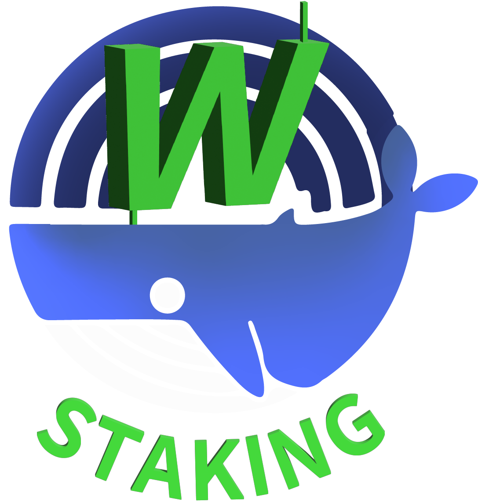

 
  

<h1 style="margin-left: 75px; margin-bottom: 50px;">
  WStaking – Intelligent Crypto Staking with Optimized Yield
</h1>

---

*Smart staking with optimized returns – built for long-term growth.* 🚀

**WStaking** is a staking platform, offering dynamic APRs based on your selected lock-in duration. Whether you commit for 1 month or 12, **WStaking** gives you a secure and flexible way to grow your holdings through smart contract-based staking powered by advanced trading strategies.

---

## 🚀 How It Works

1. **Connect Your Wallet:** Visit **[wstaking.net](https://wstaking.net)** and connect one of the supported wallets (MetaMask, OKX, Trust, Coinbase, TokenPocket). No downloads or sign-ups required – just connect your wallet to begin.
2. **Stake USDT:** Choose the amount of USDT you want to stake. Choose your staking duration. Your USDT will be deployed in our smart contract strategy to start earning rewards immediately.
3. **Earn & Claim Rewards:** Watch your balance grow with **high-yield APR rewards** (up to 36% APR) in real time. Rewards accumulate by the minute; you can claim them whenever you like, directly to your wallet. Enjoy passive income with full flexibility!

**👉 Ready to dive in?** [**Start staking now on WStaking.net**](https://wstaking.net) and put your crypto to work for you! 💸

---

## 📚 Full Feature Breakdown

- 🔒 **Audited Smart Contracts**
- 💹 **APR up to 36%**, depending on duration + stake amount
- 🤖 **AI-Driven Yield Optimization** via OKX-based trading models
- 💼 **Multi-Wallet Support**: MetaMask, OKX, Coinbase, Trust, TokenPocket
- 🎁 **Ongoing Campaigns**: Giveaways, Airdrops, & Loyalty Rewards

---

## 🔑 Staking Duration & APR Calculation

<table>
  <thead>
    <tr>
      <th><strong>📅 Duration</strong></th>
      <th><strong>📈 APR Range</strong></th>
    </tr>
  </thead>
  <tbody>
    <tr>
      <td>1 Month</td>
      <td><strong>🔹 10%</strong></td>
    </tr>
    <tr>
      <td>3 Months</td>
      <td><strong>🔸 12% – 15%</strong></td>
    </tr>
    <tr>
      <td>6 Months</td>
      <td><strong>🟠 15% – 24%</strong></td>
    </tr>
    <tr>
      <td>12 Months</td>
      <td><strong>🟢 24% – 36%</strong></td>
    </tr>
  </tbody>
</table>

- 💡 Stakes of **10 USDT or more** qualify for at least **10% APR**  
- 📊 APR **increases progressively** with your stake amount  
- 🏆 Maximum APR is unlocked at **10,000 USDT or more**

---

## ➕ Additional Staking Rules

- **Different durations cannot be combined**  
- **Same durations can be added**, and the **entire stake period resets**
- This ensures fair APR calculation and consistent reward logic

---

## 🔁 Automatic Renewal

When your selected staking duration ends:

- Your stake **automatically renews** for the same duration  
- Rewards will **recalculate and resume** during the renewed period  
- **You can unstake anytime** after renewal **without penalty**  
- Note: **Promotional APR** applies only during the original locked period

---

## 🚫 Early Unstake & Withdrawal Policy

- **Unstaking before the end of the duration** incurs a **10% penalty**
- **Unstake withdrawals** take **7–10 days** to return to your wallet
- During this time, assets remain in trading execution – **to avoid holding loss**, avoid unnecessary unstaking

---

### 🎉 1000 USDT Community Airdrop Event 

*To thank our community, WStaking recently hosted a **1000 USDT prize pool airdrop event** for active users!*  
Stakers had the chance to **win a share of 1000 USDT** simply by staking on the platform – *the more you staked, the higher your chances of winning*.  
This **giveaway campaign** reflects our commitment to rewarding users and building an engaged community.  
*Missed out on this round?* Don’t worry – more **staking campaigns and bonus events** are on the way as WStaking continues to grow.  
Make sure to follow our updates so you can participate in the next big reward opportunity!

---

### 🤝 Community & Partnerships

WStaking isn’t just a platform – it’s a growing community. We regularly engage with our users on **social media** and through community events.  
Follow us on **[Instagram @wstaking_net](https://www.instagram.com/wstaking_net/)** for the latest announcements, tutorials, and giveaways.  

We also run a **KOL (Key Opinion Leader) and affiliate program**, partnering with influencers and community leaders to spread the word.  
If you’re a content creator or community builder with a passion for crypto, get in touch with us – **let’s grow together** and help more people discover WStaking’s benefits! 💼📢

---

